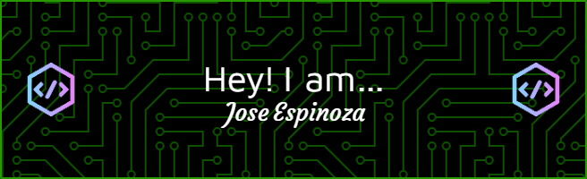

  

<h1 align="center">Alejandro Espinoza</h1>

  <strong>Apasionado por la automatización, desarrollo de herramientas y soluciones eficientes ⚙️</strong>

---

  

---

### 👋 Sobre mí

Actualmente me dedico al desarrollo e implementación de herramientas de software para optimizar flujos de trabajo en entornos de producción. Mi enfoque principal es la creación de aplicaciones de escritorio robustas, desde la programación lógica hasta su compilación, distribución y mantenimiento en redes corporativas.

---

### 🛠️ Stack Tecnológico

**Lenguajes & Core:**
- 🐍 **Python:** Desarrollo de aplicaciones GUI (Tkinter), automatización de tareas y manejo de archivos.
- ⌨️ **Scripting:** AutoHotkey y Batch para automatización nativa en Windows.
- 📊 **Datos:** Excel VBA y SQL para integración y reporte de datos.
- 🚀 **Cloud & Web:** Despliegue y administración de aplicaciones en **Render.com**.

**Despliegue & Distribución (DevOps de Escritorio):**
- 📦 **Compilación:** Experiencia con **Nuitka**, **PyInstaller** y **PyArmor** (configuración standalone, gestión de dependencias y reducción de falsos positivos en antivirus)..
- 🚀 **Update Systems:** Creación de instaladores y scripts personalizados de actualización vía red (LAN) con control de versiones y backups automáticos.
- 🛡️ **Control de Versiones:** Git, GitHub, GitHub Actions.

---

### 🔭 En qué estoy trabajando ahora

**Sistema de Monitoreo y Actualización (Monitor FVS)**
Actualmente estoy haciendo un ecosistema de **Monitoreo de flujo de producción**, una suite de herramientas de monitoreo interno.
* **Implementación:** Aplicación Python compilada a código nativo para mejorar rendimiento y seguridad.
* **Infraestructura de Actualización:** Diseño de un **Launcher híbrido** que gestiona la version local vs servidor, permitiendo actualizaciones automáticas vía red (LAN) sin intervención del usuario.

**Dashboard de Visualización Web (Render.com)**
Plataforma centralizada para el análisis de métricas.
* **Despliegue Cloud:** Configuración y puesta en producción de la aplicación en entorno PaaS (Render), asegurando alta disponibilidad.
* **Integración:** Conexión de backend Python para el procesamiento y visualización de datos en tiempo real.

---

### 📫 Contacto

* 📧 **Email:** jose.espinoza@FII-NA.com
* 💼 **LinkedIn:** [Alejandro Espinoza](https://www.linkedin.com/in/alejandro-espinoza-63aa9b168/)

---
